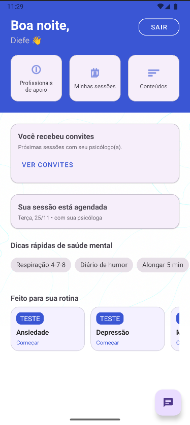

# Apoio Emocional

App Android para apoiar o bem-estar com testes rápidos, exercícios de respiração, diário do humor, chatbot e conteúdos.

## Visão geral

A tela inicial reúne os principais atalhos do app:
- **Quizzes**: ansiedade, depressão e meditação.
- **Respiração 4-7-8**.
- **Diário do humor**.
- **Chat** (FAB no canto inferior direito).
- **Conteúdos**.
- **Planos de cuidado**.

Autenticação é feita com **Firebase Auth** (login/logout). O app segue Material Design e usa componentes do AndroidX.

## Requisitos

- Android Studio atualizado
- JDK 17 (ou o recomendado pelo Android Studio)
- Dispositivo/emulador com Android 6.0+ (minSdk 23 ou superior)
- Uma conta no Firebase com o `google-services.json` do projeto

Pacote do app: `com.project.apoioemocional`

## Configuração do Firebase

1. Crie um projeto no Firebase.
2. Adicione um app Android com o pacote **com.project.apoioemocional**.
3. Baixe o **google-services.json** e coloque em `app/google-services.json`.
4. No Console do Firebase, ative **Authentication** (e outros serviços que você quiser usar).

## Como rodar

### Pelo Android Studio
1. Abra o projeto.
2. Aguarde o Gradle sincronizar.
3. Selecione um dispositivo/emulador.
4. Clique em **Run ▶**.

### Pela linha de comando
```bash
# macOS/Linux
./gradlew assembleDebug

# Windows (PowerShell/CMD)
gradlew.bat assembleDebug
```

O APK gerado fica em `app/build/outputs/apk/debug/`.

## Build & QA rápidos

- **Rebuild**: `Build > Rebuild Project`
- **Lint**: `Analyze > Inspect Code…`
- **Tests** (se houver): `./gradlew test`

## Screenshots

<p align="center">
  
  
</p>